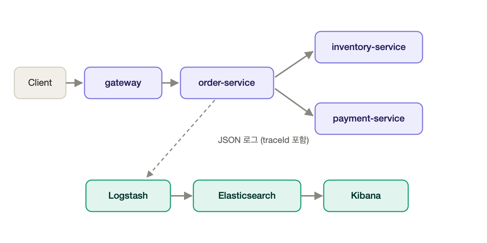

# tracing-demo

Spring Boot **분산 추적(Distributed Tracing)** 학습용 토이 프로젝트.
하나의 요청이 여러 MSA를 건너갈 때, **Trace ID** 하나로 전체 여정을 추적하는 과정을 직접 조립해 본다.
`Micrometer Tracing + OpenTelemetry` 로 traceId를 서비스 간 전파하고, 그 로그를 `ELK`(Elasticsearch·Logstash·Kibana)에 모아 검색한다.

---

## 아키텍처



```
[Client] → gateway → order-service ┬→ inventory-service
                                   └→ payment-service
                        │
                각 서비스의 JSON 로그(traceId 포함)
                        ▼
                Logstash → Elasticsearch → Kibana
```

사용자 요청 하나(`GET /api/checkout/{item}`)가 `gateway`로 들어오면, `gateway`가 `order-service`를 호출하고, `order-service`는 다시 재고(`inventory-service`)와 결제(`payment-service`)를 호출한다. 이 요청이 네 서비스를 거치는 동안 **동일한 traceId**가 `traceparent` HTTP 헤더로 자동 전파되며, 각 서비스가 남긴 JSON 로그는 Logstash → Elasticsearch로 적재되어 Kibana에서 traceId로 조회된다.

---

## 저장소 구조

```
tracing-demo/
├── boot3-demo/          # Spring Boot 3 · 단일 서비스 (traceId 콘솔 확인용, 대조군)
├── boot4-demo/          # Spring Boot 4 · 4개 MSA + ELK (본편)
│   ├── common/          # 공용 모듈: WebClient·추적/로깅 설정, 요청/응답 로깅 필터
│   ├── gateway/         # 진입점 (8080)
│   ├── order-service/   # 주문 오케스트레이션 (8081) — inventory·payment 호출
│   ├── inventory-service/ # 재고 조회 (8082)
│   ├── payment-service/ # 결제 처리 (8083)
│   ├── elk/             # Logstash 파이프라인 설정
│   └── docker-compose.yml # 4개 서비스 + Elasticsearch/Logstash/Kibana
└── docs/images/         # 아키텍처 다이어그램
```

> Boot 3와 Boot 4는 Spring Boot Gradle 플러그인 버전이 달라 하나의 Gradle 빌드로 묶을 수 없어, **독립된 두 프로젝트**로 둔다.

### 기술 스택
| | boot3-demo | boot4-demo |
|---|---|---|
| Spring Boot | 3.5 | 4.0 |
| Java | 21 | 25 |
| HTTP 클라이언트 | — | WebClient |
| 추적 | Micrometer Tracing + OpenTelemetry | Micrometer Tracing + OpenTelemetry |
| 로그 수집 | 콘솔 | ELK (Logstash → Elasticsearch → Kibana) |

---

## 실행 방법

### 전제
- Docker / Docker Compose (예: Docker Desktop, OrbStack)
- 빌드·실행은 모두 컨테이너 안에서 이루어지므로 로컬 JDK는 필요 없다.

### 1) boot3-demo — traceId가 콘솔에 찍히는지 확인
```bash
cd boot3-demo
docker compose up --build -d
curl http://localhost:8090/hello
docker compose logs boot3-demo | grep "hello 요청 처리"
```
→ 로그에 `[boot3-demo,<traceId>,<spanId>]` 형태로 추적 ID가 찍히면 정상.
```bash
docker compose down
```

### 2) boot4-demo — 4개 서비스 + ELK로 요청 추적
```bash
cd boot4-demo
docker compose up --build -d      # 최초 빌드 수 분 소요
```
Elasticsearch가 준비될 때까지(보통 30~60초) 기다린 뒤 요청을 보낸다.
```bash
# 상태 확인
curl -s localhost:9200/_cluster/health          # status가 green/yellow면 준비 완료
curl -s localhost:8080/actuator/health           # gateway 200

# 요청 발사 (한 번이 4개 서비스를 관통)
curl http://localhost:8080/api/checkout/keyboard
```
콘솔 로그로도 확인할 수 있다.
```bash
docker compose logs gateway order-service inventory-service payment-service \
  | grep "http.access - inbound request" | tail -4
# → 4줄 모두 같은 traceId 이면 정상
```

#### Kibana에서 traceId로 추적
1. http://localhost:5601 접속 (최초 로딩 1~2분)
2. **Stack Management → Data Views → Create data view**
   - Index pattern: `tracing-demo-*`, Timestamp: `@timestamp`
3. **Discover** → 컬럼 추가: `service` `method` `uri` `status` `elapsedMs` `traceId`
4. 검색창에 `traceId : "<로그에서 확인한 값>"` 입력
   → gateway·order·inventory·payment 로그가 **동일한 traceId**로 한 화면에 조회된다.

정리:
```bash
docker compose down          # 컨테이너 종료
docker compose down -v       # 볼륨까지 삭제(ES 데이터 초기화)
```

#### (부록) ELK 매핑 폭발(Mapping Explosion) 재현
동적으로 변하는 값을 필드 **값**이 아니라 **키**로 넣으면, 요청마다 새 필드가 생겨 인덱스의 `index.mapping.total_fields.limit`(기본 1000)을 넘고 인덱싱이 거부된다. ES가 떠 있는 상태에서 아래 스크립트로 재현할 수 있다.
```bash
bash scripts/mapping-explosion-demo.sh
```
- 좋은 패턴(`traceId`를 값으로) → 필드 수 고정, 안전
- 나쁜 패턴(동적 값을 키로) → 필드 1000개 초과 → `Limit of total fields [1000] has been exceeded` (HTTP 400)

### 서비스 포트
| 서비스 | 포트 |
|---|---|
| gateway | 8080 |
| order-service | 8081 |
| inventory-service | 8082 |
| payment-service | 8083 |
| boot3-demo | 8090 |
| Elasticsearch | 9200 |
| Kibana | 5601 |
| Logstash | 5000(app→logstash), 9600 |

---

## 핵심 포인트 — Boot 3 vs Boot 4 추적 의존성

같은 추적을 켜는데 **필요한 의존성이 다르다.** 이 프로젝트의 핵심 학습 지점이다.

**Boot 3** — 두 개면 충분 (추적 자동 구성이 `actuator`에 포함):
```groovy
implementation 'org.springframework.boot:spring-boot-starter-actuator'
implementation 'io.micrometer:micrometer-tracing-bridge-otel'
```

**Boot 4** — 위 두 개만으로는 `traceId`가 **빈칸**이 된다. 자동 구성이 모듈로 분리되어, 아래를 직접 추가해야 진짜 `Tracer`가 생성된다:
```groovy
implementation 'org.springframework.boot:spring-boot-opentelemetry'
implementation 'org.springframework.boot:spring-boot-micrometer-tracing-opentelemetry'
implementation 'io.micrometer:micrometer-tracing-bridge-otel'
```

- `traceparent` 헤더는 계측된 `WebClient`가 자동 주입 → 개발자가 직접 넣지 않는다.
- Spring Cloud Sleuth는 Spring Boot 3.0부터 지원 종료. 지금은 Micrometer Tracing + OpenTelemetry가 대체한다.
  ([Spring Boot 4.0 Migration Guide](https://github.com/spring-projects/spring-boot/wiki/Spring-Boot-4.0-Migration-Guide))

---

## 참고
- Spring Boot Tracing 문서 — <https://docs.spring.io/spring-boot/reference/actuator/tracing.html>
- Micrometer Tracing — <https://docs.micrometer.io/tracing/reference>
